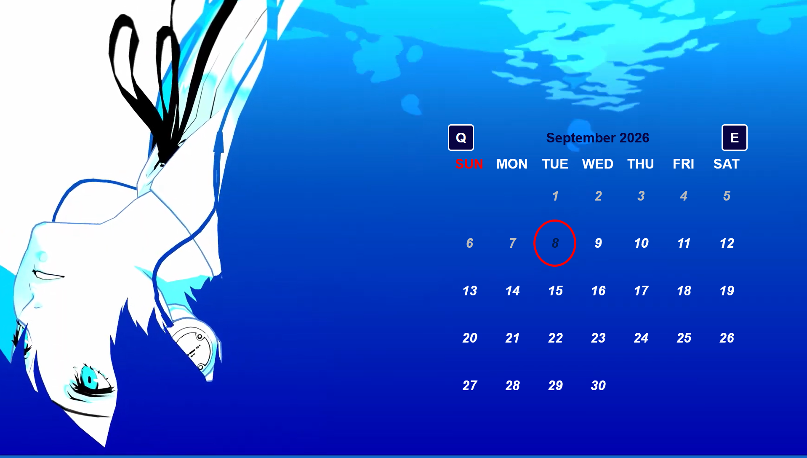

### Persona 3 Reload Inspired Calendar Website

## Overview

This project is a Persona 3 Reload-inspired calendar website built with HTML, CSS, and JavaScript. The design focuses on a dark-blue and white visual style with red accents, a looping video background, and keyboard-based month navigation.

The calendar is designed to feel like a stylized in-game interface rather than a traditional calendar application.

## Project Structure

project/
├── index.html
├── css/
│   └── style.css
├── js/
│   └── main.js
└── src/
    ├── background.mp4
    ├── favicon.ico
    └── preview.png

## Preview

Here is a preview image of the site.

